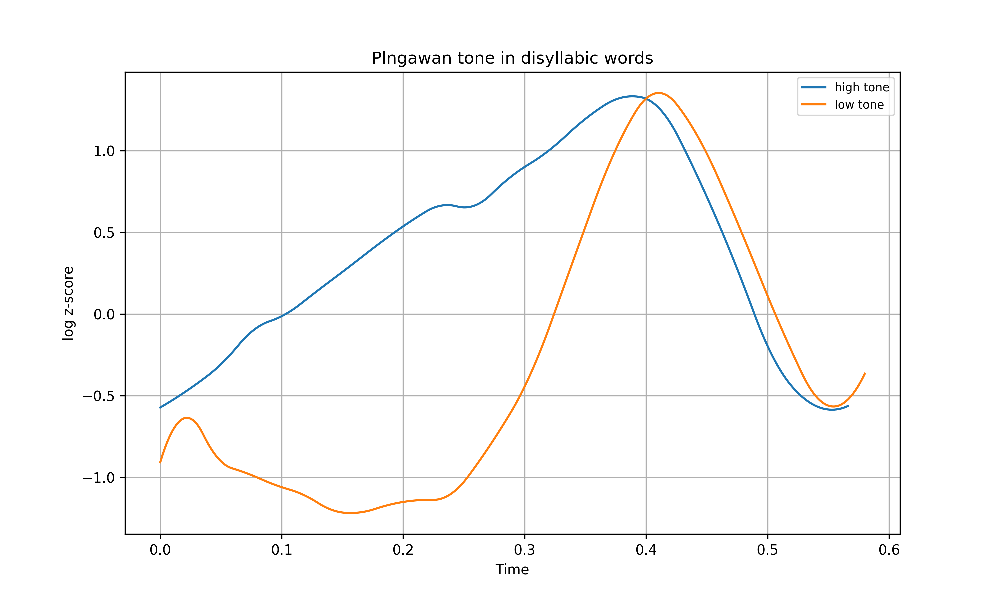
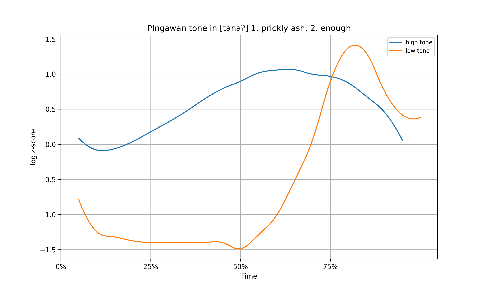
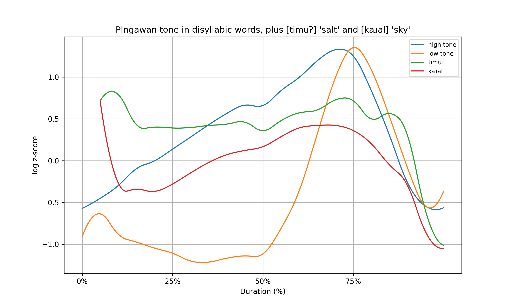
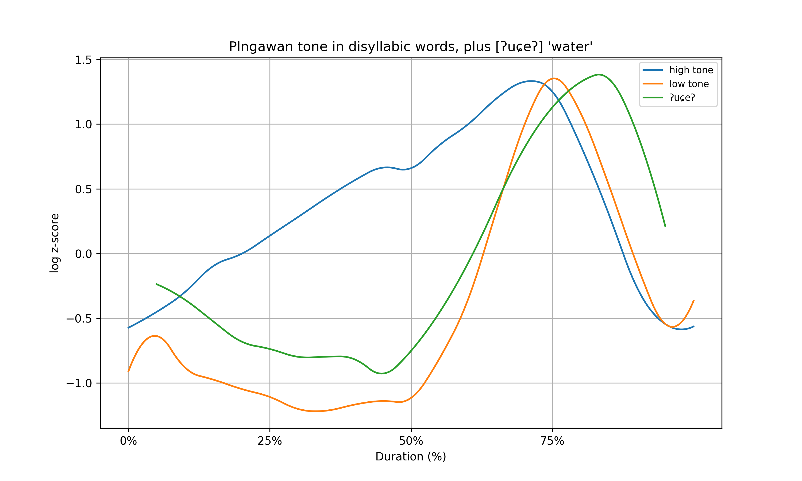

#+MACRO: nl @@html: @@
#+MACRO: audio @@html:<audio controls src="./audio/$1"></audio>@@

* Introduction

** Plngawan Atayal
- Plngawan Atayal is a small but highly aberrant Atayal dialect spoken in Nantou County, Taiwan.
  - Atayal is not tonal... @@html:<bold class="fragment fade-in">or so we thought.</bold>@@
  - Some segmentally identical words are distinguished using suprasegmental features.

** The phenomenon
/[baluŋ]/
| Tone | Gloss        | Audio                        |
|------+--------------+------------------------------|
| high | 'hollow log' | {{{audio(balung-high.wav)}}} |
| low  | 'thunder'    | {{{audio(balung-low.wav)}}}  |

** The phenomenon
- Minimal pairs so far limited to disyllables.
  - The tone appeas on the penult, and is orthogonal to stress.
- Low functional load.

** Minimal pairs
| Segments | High tone     | Low tone          |
|----------+---------------+-------------------|
| /[baluŋ]/  | 'hollow log'  | 'thunder'         |
| /[ɹuŋiː]/  | 'monkey'      | 'to forget (imp)' |
| /[tanaʔ]/  | 'prickly ash' | 'enough'          |
| /[tabiŋ]/  | 'peanut'      | 'to touch (imp)'  |

** Intradialectal variation
- There is a lot of variation within Plngawan.
  - Not all speakers have all minimal pairs.
  - Some pairs appear solid across speakers.

** Serendipitious{{{nl}}}discovery

** Previous mentions
- Plngawan tone only mentioned by [cite/t: @chen2012 56-58].
  - She gave a surprisingly accurate description, but never followed up on it.

** Caveat
- My research on this is still in its initial stages.
  - This is a progress report.

* Methodology
** Methodology
- I used the approach by [cite/t: @dam2018 25-62] to compare pitch between speakers.
- Hz were converted into Semitones, whose z-score was then calculated in units of standard deviations.
  - The resulting scale shows *logarithmic z-scores*.

** Methodology
- Pitch measurements were taken 11 times per syllable in Praat (every 10%).
- This allows for syllable-wise duration normalization.

** Methodology
- In this initial study, I used a total of 49 tokens across 3 speakers.
  - 2 female, 1 male speaker.
  - 27 high tone, 22 low tone tokens, not including other lexical items.

** Methodology
- Tokens from minimal pairs were marked for high or low tone.
- Their log z-scores were averaged to produce a pitch plot.

* Results
** 

** Results: pitch
- Clear difference in pitch on the penult.
- The final syllable is almost identical, and shows the pitch peak (tentatively stress).

** Results: length
- Duration normalization proved unnecessary.
- Likely no length distinction between tones.

** Results: formants
- I also took a few formant measurements manually.
  - Penult vowel F1 seems to be consistently higher in high tone (including in [u]!).
  - More work is needed in this direction.

** Results: pitch
- Pitch on chart starts low because voiced initial /[baluŋ]/ and /[ɹuŋiː]/ are overrepresented.
- Looking at just /[tanaʔ]/ shows higher initial pitch as expected.

** 

** Other words
- I also tried comparing words with no minimal pairs.
- Most seem to align more closely with the high tone.

** 

** 

* Discussion

** Possible origins
- Plngawan tone is unlike Sinitic style tonogenesis as per [cite/t: @haudricourt1954].
  - No sesquisyllabic structure, no loss of final segments or voicing.
  - The tone itself is confined to the penultima.

** Possible origins
- In one case, affixation is involved.
  - PA /*ɹuŋay/ 'monkey' > Pl /[ɹúŋiː]/.
  - PA /*ɹuŋiʔ/ 'to forget' + /-i/ 'PV.Subj' > Pl /[ɹùŋiː]/.

** Possible origins
- In another case, the segments were originally distinct.
  - PA /*tanaʔ/ 'prickly ash' (cf. PAn *tanaq) > Pl /[tánaʔ]/.
  - PA /*tənaq/ 'enough' > Pl /[tànaʔ]/.

** Possible origins
- PA /*baluŋ/ 'log' > Pl /[báluŋ]/.
- No known source for Pl /[bàluŋ]/ 'thunder'.

** Possible origins
- Some speakers have /[tàbiŋ]/ while others have /[tasbiŋ]/ for 'to touch'.
- Pitch drop before sibilants? Cf. /[ʔuɕeʔ]/ 'water'.

** Possible origins :noexport:
Note that Ladefoged's Intro to Phonetics says (p. 260) that
the morphology of anden 'duck' and 'ghost' is different:
'duck' is [and + -en],
'ghost' is [ande + -n],
Pl tones are on monomorphemic lexical items

** Further study
- The first results are interesting, but bring even more questions.
  - Below is a list of questions I would like to answer next.

** Further study
- What is the default tone?
- Are tones restricted to disyllables? What about longer words?
- Do some consonants imply a specific tone?
- Is tone connected to morphology? (Cf. imperative verbs)
- Are formants consistently affected?

** Further study
- If tone is not predictable, is it inherited?
- Do other Atayal dialects have tone??

* Thank you

** References
